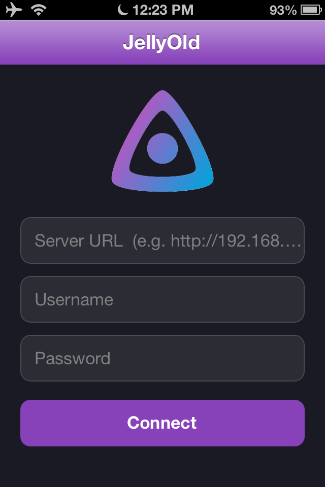
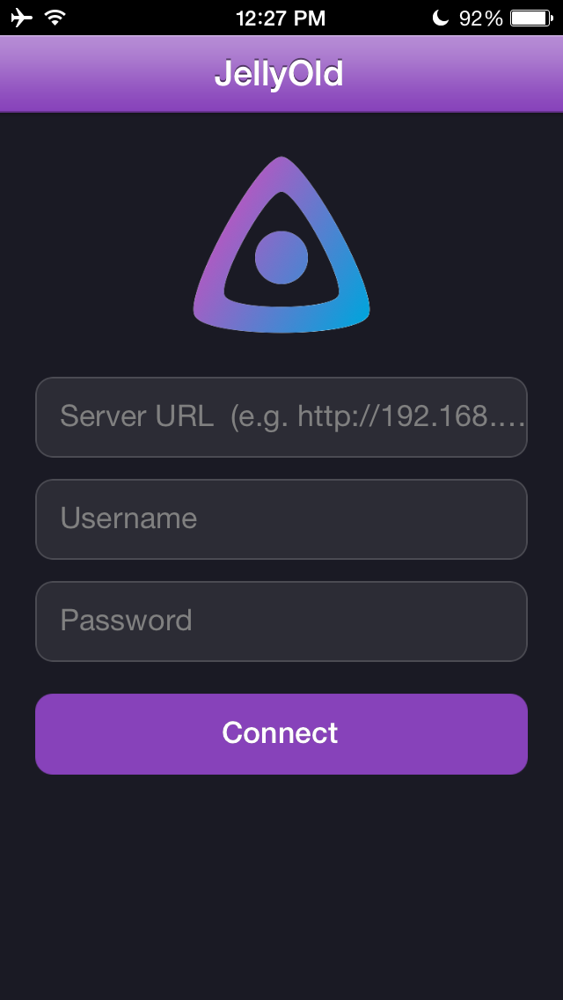

<p align="center">
  
</p>

<h1 align="center">jellyold</h1>

<p align="center">
  A native <a href="https://jellyfin.org">Jellyfin</a> client for <b>iOS 6 through 9</b>.<br>
  Written in Swift, built for hardware Apple stopped supporting more than a decade ago.
</p>

<p align="center">
  
  
  
</p>

---

## Philosophy

- **Your server, your media.** jellyold talks to *your* Jellyfin instance and nothing else.
  There is no vendor backend, no account with us, no middleman.
- **No tracking.** No analytics SDK, no crash reporter, no telemetry, no phone-home.
- **No third-party services.** The app speaks the plain Jellyfin HTTP API. Credentials and
  the auth token live in `UserDefaults` on the device; downloads live in the app sandbox.
- **Old hardware deserves good software.** An iPhone 4S is a perfectly capable media
  player. The only thing that stopped working was the software.

> jellyold is an independent project. It is not affiliated with, endorsed by, or connected
> to the Jellyfin project or the Jellyfin Foundation.

---

## Screenshots

| Login — iPhone 4S / iOS 6 | Login — iPhone 5 / iOS 7 |
|---|---|
|  |  |

---

## Features

**Libraries**
- Movies, TV Shows, Music, Playlists, Home videos & photos, plain Folders
- Poster grid with async artwork loading and an in-memory image cache
- Sort by Date Added / Name / Year, remembered per collection type

**TV**
- Series → Seasons → Episodes, with single-season shows skipping the season screen
- Episode rows with thumbnail, `S01E01` label, title and synopsis

**Video playback**
- Streams from your server, fullscreen, with rotation support
- Audio track and subtitle selection
- Resume where you left off
- `MPMoviePlayerController` on iOS 6/7, `AVPlayer` on iOS 8/9

**Audio**
- Queue with Play / Play Next / Add to Queue
- Now Playing screen with artwork, scrubber and transport controls
- Persistent mini player bar that survives navigation
- Background audio with lock-screen controls
- The queue is restored on relaunch

**Photos**
- Full-screen viewer with pinch and double-tap zoom, swipe between photos

**Offline**
- Download movies and episodes for offline playback
- Quality picker: Original (remux, no re-encode) / 720p / 480p / 360p
- Downloads list with live progress and swipe-to-delete
- A downloaded item plays from local storage automatically

---

## Install

### Recommended — via the repo (Cydia / Sileo / Zebra)

Add this source:

```
https://cydia.rousseaddict.online
```

The repo page also exposes a direct **OTA install link**, so you can install straight from
Safari on the device without a package manager.

### Manual — sideload the IPA

Prebuilt IPAs live in [`build/`](build/). Pick the one that matches the device:

| File | Target | Notes |
|---|---|---|
| `build/jellyold_ios6.ipa` | iOS 6 – 7 | The baseline build. Swift runtime downgraded and Mach-O version-min patched. |
| `build/jellyold_ios8.ipa` | iOS 8 – 9 | Uses the modern API set (`AVPlayer`, `URLSession`-era UIKit). |

The IPAs are **ad-hoc signed**, so they install on a jailbroken device
(Filza, `ipainstaller`, AppSync) but not on a stock one. To run on a stock device you must
re-sign the IPA with your own certificate.

---

## Tested on

| Device | OS | Build | Status |
|---|---|---|---|
| iPhone 4S | iOS 6 | `ios6` | Works |
| iPhone 5 | iOS 7 | `ios6` | Works, full 4-inch screen |
| iPad mini (1st gen) | iOS 8 | `ios8` | Works |

---

## Known limitations

- **No search.** Browsing only, for now.
- **No user switching.** One server, one account, entered manually — there is no server
  discovery.
- **Audio downloads are not supported.** Offline is video-only.
- **Artwork does not use the bundled TLS stack.** Posters and photos still go through
  `NSURLConnection`, so on a Jellyfin server that only offers AES-GCM cipher suites the
  media will play on iOS 6 but the images will not load.
- **Transcoding is your server's job.** A 4S cannot decode HEVC or 4K; anything the device
  cannot play natively has to be transcoded by Jellyfin, which needs a server with the
  headroom to do it.
- **No Chromecast / AirPlay controls, no comments, no live TV.**

---

## How it works

Two problems had to be solved to make a modern Jellyfin server work on a 2012 OS:

1. **TLS.** iOS 6 only negotiates CBC cipher suites. Most current Jellyfin deployments —
   especially anything behind a modern reverse proxy — require AES-GCM, which arrived in
   iOS 7. Every API request therefore goes through a statically linked
   **libcurl 8.20 + OpenSSL 3.4**, bypassing the system TLS stack entirely.

2. **The media players.** `MPMoviePlayerController` and `AVPlayer` do their own networking
   and cannot be routed through libcurl. jellyold runs a **loopback HTTP proxy** on the
   device: the player connects to `127.0.0.1`, the proxy fetches the real bytes over
   libcurl and relays them, including range requests and seeking. HLS playlists are
   rewritten on the fly so segment URIs also come back through the proxy.

---

## Building

Building requires macOS with **Xcode 13.2.1** and both the **Swift 5.6.3** and
**Swift 5.1.5** toolchains installed side by side.

```bash
./build.sh        # both targets
./build.sh ios6   # jellyold_ios6.ipa only
./build.sh ios8   # jellyold_ios8.ipa only
```

Both targets come from the same source tree, separated by a compile-time flag:

| Target | Flag | Deployment |
|---|---|---|
| iOS 6/7 | `-D IOS6_TARGET` | 7.0, version-min patched down to 6.0 |
| iOS 8/9 | `-D IOS8_TARGET` | 8.0 |

The pipeline compiles with **5.6.3** — the 5.1.5 compiler cannot parse modern SDK headers
— then swaps the bundled Swift runtime dylibs for the **5.1.5** ones, which are the newest
that still run on iOS 6. Swift's ABI stability is what makes that combination work. The
`libswiftMetal` dylib is dropped (Metal does not exist before iOS 8, and A5/A6 chips never
supported it), `LC_VERSION_MIN_IPHONEOS` and `MinimumOSVersion` are patched down, and
everything is ad-hoc signed before being zipped into an IPA.

Because the two targets share one DerivedData directory, always run a **clean** build when
switching flags — Swift's incremental compiler will otherwise silently reuse objects built
with the previous flag.

See [`CLAUDE.md`](CLAUDE.md) for the full step-by-step pipeline.

---

## License

jellyold is free software, licensed under the **GNU General Public License v3.0**.
See [`LICENSE.txt`](LICENSE.txt) for the full text.

```
Copyright (C) 2026 RousseAddict

This program is free software: you can redistribute it and/or modify it under the
terms of the GNU General Public License as published by the Free Software Foundation,
either version 3 of the License, or (at your option) any later version.

This program is distributed in the hope that it will be useful, but WITHOUT ANY
WARRANTY; without even the implied warranty of MERCHANTABILITY or FITNESS FOR A
PARTICULAR PURPOSE. See the GNU General Public License for more details.
```

Bundled third-party components:

| Component | License | GPL-3.0 compatible |
|---|---|---|
| libcurl 8.20.0 | curl (MIT-like) | Yes |
| OpenSSL 3.4.6 | Apache-2.0 | Yes |
| [Phosphor Icons](https://phosphoricons.com) | MIT | Yes |
